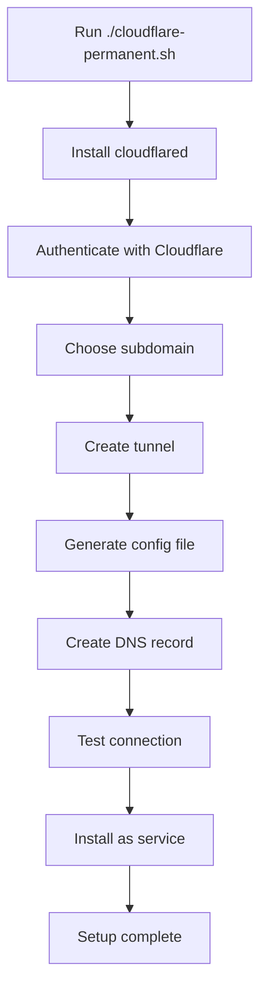
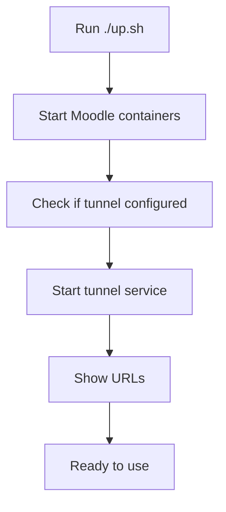

# 🏆 Permanent Tunnel Solution

**One consolidated script for permanent static URL access to your Moodle platform**

## 🎯 What You Get

- **Static URL**: `https://learning.manfreetechnologies.com` (never changes)
- **Auto-Start**: Tunnel starts automatically with Moodle
- **Auto-Fix**: Automatically resolves common issues
- **WSL Ready**: Handles PC restarts and WSL auto-start
- **Zero Maintenance**: Set it once, forget it

---

## 🚀 Quick Setup

### 1. One-Time Authentication
```bash
cloudflared tunnel login
```
*Complete browser authentication with your Cloudflare account*

### 2. Complete Setup
```bash
./global-access/permanent/setup.sh
```
*This handles everything: installation, configuration, service setup*

### 3. Done!
Your Moodle is now permanently accessible at:
- **Local**: `http://localhost:8080`
- **Global**: `https://learning.manfreetechnologies.com`

---

## 🔧 Management Commands

```bash
# Check tunnel status
./global-access/permanent/setup.sh --status

# Health check (diagnose issues)
./global-access/permanent/setup.sh --health-check

# Health check + auto-fix
./global-access/permanent/setup.sh --health-check-fix

# Start/stop/restart tunnel
./global-access/permanent/setup.sh --start
./global-access/permanent/setup.sh --stop
./global-access/permanent/setup.sh --restart

# Show help
./global-access/permanent/setup.sh --help
```

## 🎯 What This Solution Provides

### ✅ Before vs After

| Before (Temporary) | After (Permanent) |
|-------------------|-------------------|
| `https://abc123.ngrok-free.app` | `https://learning.manfreetechnologies.com` |
| Changes every restart | **Never changes** |
| 2-hour time limits | **No time limits** |
| Random URLs | **Your branded URL** |
| Manual startup | **Auto-starts with Moodle** |

### 🌟 Key Benefits

- **🔗 Static URL**: `learning.manfreetechnologies.com` never changes
- **🚀 Auto-Start**: Tunnel starts automatically when you run `./up.sh`
- **🔒 HTTPS**: Automatic SSL certificates from Cloudflare
- **🌍 Global**: Accessible from anywhere in the world
- **💰 Free**: No additional costs (you already own the domain)
- **🔧 Google OAuth Ready**: Perfect for authentication services

---

## 📋 Implementation Overview

### How It Works

```
Your Moodle (localhost:8080) 
    ↓
Cloudflared Agent (on your machine)
    ↓
Cloudflare Network (global)
    ↓
learning.manfreetechnologies.com
    ↓
Students worldwide
```

### Components

1. **cloudflared** - Tunnel agent running on your machine
2. **Cloudflare DNS** - Points your subdomain to the tunnel
3. **systemd service** - Auto-starts tunnel with your system
4. **Moodle integration** - Smart URL detection

---

## 🛠️ Two Scripts Explained

### 1. `cloudflare-permanent.sh` - One-Time Setup Script

**Purpose**: Complete initial setup and configuration

**What it does:**
- ✅ Installs cloudflared if not present
- ✅ Authenticates with your Cloudflare account
- ✅ Creates a named tunnel with unique ID
- ✅ Generates configuration file
- ✅ Creates DNS record in Cloudflare
- ✅ Tests the connection
- ✅ Installs as system service
- ✅ Updates Moodle configuration

**When to use**: Run once during initial setup

**Command:**
```bash
cd global-access/permanent
./cloudflare-permanent.sh
```

**Interactive Process:**
1. Checks if cloudflared is installed
2. Asks you to choose subdomain (learning, lms, courses, etc.)
3. Creates tunnel and shows tunnel ID
4. Tests both local and global access
5. Installs as permanent service

### 2. `auto-tunnel.sh` - Daily Operations Script

**Purpose**: Start/stop/manage tunnel service

**What it does:**
- ✅ Starts tunnel service
- ✅ Stops tunnel service  
- ✅ Shows tunnel status
- ✅ Integrated with `./up.sh` and `./down.sh`

**When to use**: Automatically called by `./up.sh`, or manually for management

**Commands:**
```bash
cd global-access/permanent

./auto-tunnel.sh start     # Start tunnel
./auto-tunnel.sh stop      # Stop tunnel
./auto-tunnel.sh status    # Check status
./auto-tunnel.sh restart   # Restart tunnel
```

---

## 🔧 Technical Implementation Details

### Configuration Files Created

#### 1. `~/.cloudflared/config.yml`
```yaml
tunnel: 2b24508c-fbed-4586-9190-e2a5b622c2ee
credentials-file: /home/manfree/.cloudflared/2b24508c-fbed-4586-9190-e2a5b622c2ee.json

ingress:
  - hostname: learning.manfreetechnologies.com
    service: http://localhost:8080
  - service: http_status:404
```

**Explanation:**
- `tunnel`: Your unique tunnel ID
- `credentials-file`: Authentication credentials
- `hostname`: Your chosen subdomain
- `service`: Points to local Moodle on port 8080
- `http_status:404`: Catch-all for other requests

#### 2. `~/.cloudflared/cert.pem`
- Authentication certificate from Cloudflare
- Created during `cloudflared tunnel login`
- Allows tunnel creation and DNS management

#### 3. `~/.cloudflared/[tunnel-id].json`
- Tunnel-specific credentials
- Created when tunnel is created
- Required for tunnel to connect

### System Service Integration

#### Service File: `/etc/systemd/system/cloudflared.service`
```ini
[Unit]
Description=cloudflared
After=network.target

[Service]
Type=simple
User=root
ExecStart=/usr/bin/cloudflared tunnel run
Restart=on-failure
RestartSec=5s

[Install]
WantedBy=multi-user.target
```

**Service Commands:**
```bash
# Check status
sudo systemctl status cloudflared

# Start service
sudo systemctl start cloudflared

# Stop service
sudo systemctl stop cloudflared

# Enable auto-start on boot
sudo systemctl enable cloudflared

# View logs
sudo journalctl -u cloudflared -f
```

### DNS Configuration

**Cloudflare DNS Record Created:**
```
Type: CNAME
Name: learning
Content: 2b24508c-fbed-4586-9190-e2a5b622c2ee.cfargotunnel.com
Proxy: Enabled (Orange Cloud)
```

**What this means:**
- `learning.manfreetechnologies.com` → points to your tunnel
- Cloudflare proxy enabled for SSL and performance
- DNS managed automatically by cloudflared

### Moodle Integration

#### Smart URL Detection in `customizations/config/config.php`
```php
// Dynamic URL detection for tunnels
if (isset($_SERVER['HTTP_HOST']) && strpos($_SERVER['HTTP_HOST'], 'learning.manfreetechnologies.com') !== false) {
    $CFG->wwwroot = 'https://learning.manfreetechnologies.com';
    $CFG->sslproxy = true;
    $_SERVER['HTTPS'] = 'on';
    $_SERVER['SERVER_PORT'] = 443;
} else {
    $CFG->wwwroot = 'http://localhost:8080';
}
```

**How it works:**
- Detects incoming request hostname
- If from tunnel domain → configures HTTPS mode
- If from localhost → configures HTTP mode
- Automatic switching, no manual changes needed

---

## 🚀 Automation Integration

### Integration with `./up.sh`

**Modified `up.sh` script:**
```bash
# Build and start containers
docker-compose up -d --build

# Auto-start tunnel if configured
if [ -f "./global-access/permanent/auto-tunnel.sh" ]; then
    chmod +x ./global-access/permanent/auto-tunnel.sh
    ./global-access/permanent/auto-tunnel.sh start
fi

echo "✅ Platform started successfully!"
echo "🌐 Access: http://localhost:8080"
if systemctl is-active cloudflared &>/dev/null; then
    echo "🌍 Global Access: https://learning.manfreetechnologies.com"
fi
```

**What happens when you run `./up.sh`:**
1. Starts Moodle Docker containers
2. Checks if permanent tunnel is configured
3. Automatically starts tunnel service
4. Shows both local and global URLs
5. No manual tunnel startup needed!

### Integration with `./down.sh`

**Modified `down.sh` script:**
```bash
# Stop containers
docker-compose down

# Show tunnel status
if systemctl is-active cloudflared &>/dev/null; then
    echo "🌍 Tunnel still running: https://learning.manfreetechnologies.com"
    echo "   Stop with: sudo systemctl stop cloudflared"
fi
```

**What happens when you run `./down.sh`:**
1. Stops Moodle Docker containers
2. Shows tunnel is still running (by design)
3. Provides command to stop tunnel if needed
4. Tunnel stays active for continuous access

---

## 🔍 Step-by-Step Process Flow

### Initial Setup (One-Time)



### Daily Usage (Automatic)



---

## 🔧 Troubleshooting Guide

### Common Issues and Solutions

#### 1. Setup Script Fails
**Symptom**: `cloudflare-permanent.sh` exits with error

**Check:**
```bash
# Verify cloudflared installation
cloudflared --version

# Check authentication
ls ~/.cloudflared/cert.pem

# Test Cloudflare connectivity
ping 1.1.1.1
```

**Solutions:**
- Re-run authentication: `cloudflared tunnel login`
- Check internet connection
- Verify domain is on Cloudflare

#### 2. Tunnel Service Won't Start
**Symptom**: `auto-tunnel.sh start` fails

**Check:**
```bash
# Check service status
sudo systemctl status cloudflared

# View service logs
sudo journalctl -u cloudflared -n 20

# Test config file
cloudflared tunnel ingress validate
```

**Solutions:**
```bash
# Restart service
sudo systemctl restart cloudflared

# Reinstall service
sudo cloudflared service install
```

#### 3. DNS Not Resolving
**Symptom**: `learning.manfreetechnologies.com` doesn't resolve

**Check:**
```bash
# Test DNS resolution
nslookup learning.manfreetechnologies.com

# Check Cloudflare DNS
dig learning.manfreetechnologies.com
```

**Solutions:**
- Wait for DNS propagation (5-30 minutes)
- Clear local DNS cache
- Try different DNS servers (8.8.8.8)

#### 4. HTTP 530 Error
**Symptom**: `curl https://learning.manfreetechnologies.com` returns 530

**Check:**
```bash
# Verify Moodle is running
curl -I http://localhost:8080

# Check tunnel connections
sudo journalctl -u cloudflared | grep "Registered tunnel connection"
```

**Solutions:**
```bash
# Restart Moodle
./down.sh && ./up.sh

# Restart tunnel
sudo systemctl restart cloudflared
```

### Diagnostic Commands

```bash
# Complete system check
echo "=== Moodle Status ==="
docker ps | grep moodle

echo "=== Tunnel Service ==="
sudo systemctl status cloudflared

echo "=== Tunnel Info ==="
cloudflared tunnel list

echo "=== DNS Resolution ==="
nslookup learning.manfreetechnologies.com

echo "=== Local Access ==="
curl -I http://localhost:8080

echo "=== Global Access ==="
curl -I https://learning.manfreetechnologies.com
```

---

## 📊 Monitoring and Maintenance

### Health Checks

**Daily Check Script:**
```bash
#!/bin/bash
# health-check.sh

echo "🔍 Permanent Tunnel Health Check"
echo "================================"

# Check service
if systemctl is-active cloudflared &>/dev/null; then
    echo "✅ Tunnel service: Running"
else
    echo "❌ Tunnel service: Stopped"
fi

# Check local Moodle
if curl -s -o /dev/null http://localhost:8080; then
    echo "✅ Local Moodle: Accessible"
else
    echo "❌ Local Moodle: Not accessible"
fi

# Check global access
HTTP_CODE=$(curl -s -o /dev/null -w "%{http_code}" https://learning.manfreetechnologies.com)
if [[ "$HTTP_CODE" == "200" || "$HTTP_CODE" == "303" ]]; then
    echo "✅ Global access: Working (HTTP $HTTP_CODE)"
else
    echo "❌ Global access: Issues (HTTP $HTTP_CODE)"
fi

# Check tunnel connections
CONNECTIONS=$(sudo journalctl -u cloudflared --since "1 hour ago" | grep "Registered tunnel connection" | wc -l)
echo "📊 Tunnel connections (last hour): $CONNECTIONS"
```

### Performance Monitoring

**Check Response Times:**
```bash
# Test response time
curl -w "@curl-format.txt" -o /dev/null -s https://learning.manfreetechnologies.com

# Create curl-format.txt:
echo "time_total: %{time_total}s" > curl-format.txt
```

**Monitor Service Uptime:**
```bash
# Check service uptime
sudo systemctl show cloudflared --property=ActiveEnterTimestamp

# Check for service restarts
sudo journalctl -u cloudflared | grep "Started\|Stopped"
```

---

## 🔐 Security Considerations

### Tunnel Security

**1. Protect Credentials:**
```bash
# Secure permissions
chmod 600 ~/.cloudflared/*.json
chmod 600 ~/.cloudflared/cert.pem

# Backup credentials
cp ~/.cloudflared/*.json ~/backup/
```

**2. Monitor Access:**
```bash
# Check Moodle access logs
docker exec manfree_moodle tail -f /var/log/apache2/access.log

# Monitor for unusual patterns
grep "learning.manfreetechnologies.com" /var/log/apache2/access.log
```

**3. Firewall Configuration:**
```bash
# Block direct access to port 8080 from external
sudo ufw deny 8080
sudo ufw allow from 127.0.0.1 to any port 8080
```

### Best Practices

1. **Regular Updates:**
   ```bash
   # Update cloudflared monthly
   sudo apt update && sudo apt upgrade cloudflared
   sudo systemctl restart cloudflared
   ```

2. **Backup Configuration:**
   ```bash
   # Weekly backup
   cp ~/.cloudflared/config.yml ~/backup/config-$(date +%Y%m%d).yml
   ```

3. **Monitor Logs:**
   ```bash
   # Check for errors daily
   sudo journalctl -u cloudflared --since "24 hours ago" | grep -i error
   ```

---

## 🎯 Summary

### What You Get

**After running the setup once:**
- ✅ **Permanent URL**: `https://learning.manfreetechnologies.com`
- ✅ **Auto-start**: Tunnel starts with `./up.sh`
- ✅ **No maintenance**: Runs automatically
- ✅ **Professional**: Branded URL for your institution
- ✅ **Reliable**: Enterprise-grade infrastructure

### Daily Workflow

```bash
# Start everything (Moodle + Tunnel)
./up.sh

# Your Moodle is now available at:
# - Local: http://localhost:8080
# - Global: https://learning.manfreetechnologies.com

# Stop Moodle (tunnel keeps running)
./down.sh
```

### Key Files

- `cloudflare-permanent.sh` - One-time setup
- `auto-tunnel.sh` - Daily operations
- `~/.cloudflared/config.yml` - Tunnel configuration
- `customizations/config/config.php` - Moodle smart detection

### 📚 Additional Documentation

- **[Script Documentation](SCRIPT-DOCUMENTATION.md)** - Detailed technical implementation
- **[Complete Setup Guide](CLOUDFLARE-PERMANENT-TUNNEL.md)** - Step-by-step instructions

**Your permanent tunnel is now fully documented and ready for production use!**